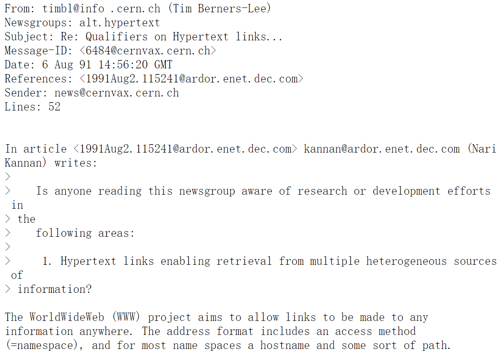
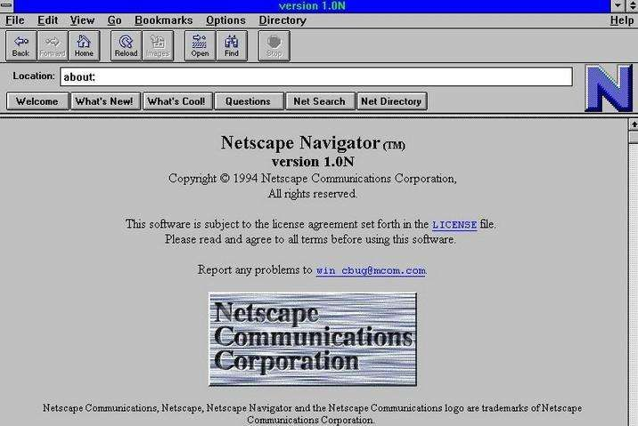

# 1.1.1 Web开发的变迁

## 时间线

### 1.洪荒时代（1989 ~ 1994）

- 1989 年 英国人Tim Berners-Lee 提出 Web 应用框架。

- 1990 年 英国人Tim Berners-Lee  在 NeXT 电脑上发明了 第一个 Web 浏览器诞生。此时的Web浏览器，只能展示静态的 HTML 内容，包含简单的文本和图像。

- 1991 年 8 月 6 日，英国人Tim Berners-Lee 在 alt.hypertext 新闻组贴出了一份关于 World Wide Web 的 [简单摘要](https://www.w3.org/People/Berners-Lee/1991/08/art-6484.txt)，这个日子因此被标志为WEB页面在 Internet 上的首次登场。

最早的 Web 主要被一帮科学家们用来共享和传递信息，全世界的 Web 服务器也就几十台。由于仅是用来传递信息，从可视化方式或从传递数量上看，仅比**电报**强一点点。

- 1993 年，CGI（Common Gateway Interface）出现了，人们可以在后端动态生成页面。

  **Perl** 由于跨操作系统和易于修改的特性成为 CGI 的主要编写语言。当然，CGI 也支持其他支持标准输入输出和环境变量的语言编写，比如 Shell 脚本、C/C++ 语言，只要符合接口标准即可。

  但显然，页面的内容更新完全由后端生成，这带来一个明显的缺憾：每次更新都要整页刷新，加上早期的网速情况，这个操作是非常慢的。因此针对这情况，人们从多方面着手改进：编写语言的升级、浏览器的升级、HTML 的升级。

- 1994 年 Netscape（网景）发布第一款 Beta 版，第一款商业浏览器 Netscape Navigator 浏览器。自从这款浏览器面世后，微软推出IE浏览器。虽说有竞争才有发展，但这也埋下了JavaScript分裂的种子。

  1994 年 PHP 诞生。PHP能将动态的内容嵌入到HTML中，提升了编写页面的效率与可读性，其性能也比一般的CGI高。PHP的界定符、循环语句等的发明，深刻影响了后来的ASP、JSP，乃致后来的JavaScript前端模板引擎。

  1994 年 10 月， W3C 小组也成立了，他们负责 HTML 的发展路径，其宗旨是通过促进通用协议的发展。

  传闻，网景工程师布兰登·艾克（Brendan Eich）只花了10天时间设计出 JavaScript 语言，近乎上帝七日创造世界那么高效。但也因为工期太短的缘故，导致许多瑕疵，因此一直被正统传序员所嫌弃，直到Ajax的出世，才让人们找到理由忍受它的畸形。早期的浏览器都配有一个选项，用来禁止JavaScript语言运行

  JavaScript主要语言特征：
  - 1.借鉴C语言的基本语法；

  - 2.借鉴Java语言的数据类型和内存管理；

  - 3.借鉴Scheme语言，将函数提升到"第一等公民"（first-class citizen）的地位；

  - 4.借鉴Self语言，使用基于原型（Prototype）的继承机制。

  时下，静态语言大行其道，类与接口被证明是构建大工程的最佳实践，人们想不出没有类的语言如何编写业务。因此当时的微软也打造了另一门运行于浏览器的语言——VBScript。

  如果继续细探JavaScript的能力，你会发现它早期真的非常空洞，一门没有灵魂的语言，没有包管理机制，也没有像Java与C++那样的打辅助用的SDK，内置的方法也屈指可数。比如说数组方法，早期只有push、pop、shift、unshift、splice、slice、sort、reverse、concat、join等操作。动态调用方面，Function的apply、call操作还没有出现！

  早年的偷懒，导致后来不得不补课：到了2019年，数组上的原型方法，是原来3倍。

  因此JavaScript诞生后，其两大任务就是完善语言特性与提高性能。这两座大山分别由著名的prototype.js与jQuery来搬掉。

### 2.浏览器战争（1994 ~ 2017）

浏览器三场战争：

- 1.Internet Exploer VS Netscape (1995 ~ 1998)

  1995年中期，人们开始注意万维网，而当时的市场及网页浏览标准均以 Netscape 主导。与此同时，微软在获取Mosaic的授权后，推出了Internet Explorer 1，于 8 月起透过“Windows 95 Plus!”搭售。

  三个月后，Internet Explorer 2 推出，而激烈竞争就此开始。在往后几年，网景和微软随后也陆续各自推出新版本的 Internet Explorer 和 Netscape Navigator。因为当时浏览器必须具备更多新功能，否则会被认为是落后的，因此当时着重产品功能特色多于修正错误，导致产品也多是不稳定的、造成网页标准分歧、时常死机和安全漏洞等问题，为用户带来困扰。

  1996 年，微软推出 Internet Explorer 3 版，成为第一款支持编程语言及 CSS 的商用浏览器，使市场占有率开始紧追 Netscape。

  1997 年 10 月，Internet Explorer 4 版正式推出，并在旧金山举行产品发表会，而引人注目的地方便是竖立了一个10尺长的巨型"e"标志。第二天早上，Netscape 的员工们在前方的草坪上发现了巨型标志，上面写着“From the IE team ... We Love You”。Netscape员工立刻把巨型标志推翻，并放上其吉祥物 Mozilla 恐龙，恐龙手上纸牌写着“Netscape 72, Microsoft 18”，代表当时的浏览器市场占有率。

  但随着 Internet Explorer 4 的推出，对这场浏览器大战产生了重大改变，它在符合 W3C 制定的网页标准方面，做得比 Netscape Navigator 4.0 要好，同时也能加载动态网页，其文字或图像的位置可以改变。此外，安装了 IE4.0 被认为是系统的升级，能增加不少功能，包括可以播放 MP3 音乐。

  在 IE 和 Netscape 大战期间，网页设计者通常会把“用 Netscape 可获得最好效果”或“用IE可获得最好效果”的标志放在主页，并连到下载相关产品的网址上。这样的网页会让开放标准造成分歧，忽略双方各浏览器的用户，因此有人发起了“可用任何浏览器浏览”（Viewable With Any Browser）运动，要求令网页无论使用 IE 或 Netscape 均能正常浏览。

  Tips:

  UA 嗅深技术，UA 即 Navigator.userAgent ，是用一个字符串来记录用户当前运行在什么操作系统与浏览器中。

  例如：Mozilla/2.0 (compatible; MSIE 3.02; Windows 95)

  #### 带来的后果

  在大战中，两者在浏览器开发上，为压倒对手，做出了以下两大行为：

  1. 把加入新功能的重要性放在修正错误之前。

  2. 使用专属格式，不尊重公开标准。

  第一次浏览器战争带来了一个问题：尽管当时有ECMA-262（JavaScript规范文档）与W3C（HTML与CSS的规范文档），微软却没有照规范来实现JavaScript、HTML与CSS，导致前端兼容问题的诞生。所以CSS Hack、浏览器判定、特性侦测，这些技术就应运而生。

  这个时代最著名的人物是Dean Edwrad，他是最早的近乎完美解决事件绑定的兼容性大神，其addEvent()内置于jQuery最早的版本中。jQuery的作者John Resig看到其超强的技艺，最后放弃推出大而全的框架，专攻选择器引擎。

  Dean Edwrad的IE7.js、IE8.js是早期处理浏览器兼容的良药，可以说是一切Polyfill的起源。他写了大量的Hack， 比如在IE如何测量元素的宽高，许多操作DOM的兼容。

  这时期太早，中国基本没有参与这次浏览器战争。

  最终，Microsoft 大获全胜，Netscape 不得不把自己卖给 AOL（**A**merica **O**n**l**ine, AOL）

  但阴霾就在微软的胜利背后涌现，直接导致了第二次浏览器大战。

- 2.Internet Exploer VS Mozilla Firefox VS Google Chrome VS Safari VS Opera (1998 ~ 2017)

  第二时期，Internet Exploer 份额逐渐受到其他浏览器蚕食，包括 Mozilla Firefox ，Google Chrome ，Safari ，Opera 。

  1998 年，Netscape 以开放源代码的授权形式，把 Communicator 源代码发布，该新产品仍然使用 Mozilla 的名称，透过把程序彻底重新编写，Mozilla 已在多方面得到改进。

  2002 年，Mozilla 推出 1.0 版，并迅即在开源社区中得以普及。同时又出现多款派生产品，包括轻量跨平台浏览器，名为 Firefox，它于2004年推出1.0版。这些以 Mozilla 为基础的产品也慢慢在浏览器市场中发展起来。

  2003 年，微软宣布 Internet Explorer 6 SP1 版本将是最后一款供独立下载的IE浏览器，而产品未来的功能加强方面将仰赖于 Windows Vista，它包括WPF、XAML等工具，以供开发者去创建扩展网络应用程序。

  2004 年 6 月，多个 IE 浏览器受到一个名为 Download.ject 的恶意程序攻击，这使人们更注意到 IE 本身的安全性问题，IE 用户只浏览一个网页，便有机会受到后门、按键记录等恶意程序入侵，而美国电脑安全事故协调中心及多间电脑安全公司也建议用户改用更安全的 Firefox，以避开此等攻击。

  2005 年 2 月，微软宣布 Internet Explorer 7 将在 Windows XP SP2 及更高的 Windows版本中提供。鉴于微软产品安全性成为人们的热门话题，微软提及新版浏览器的安全性将比 Internet Explorer 6 SP2 大大增强。由于微软未就网页标准方面表态，因此引起网页开发及标准支持者的关注。

  2006年8月，Firefox、Opera等浏览器的市场占有率持续增长，但增速放缓。据最新的调查显示，Firefox在北美，欧洲等地区的占有率已经接近或者超过20%。这使微软感受到的竞争压力倍增，促使微软加快IE7的开发步伐。

  2006年8月底，微软推出 IE7 的第一个候选版本，可以说 IE7 功能特性方面已经基本定型（ IE7 提供了标签页式浏览，RSS 阅读，增强的插件控制，CSS 等网页标准的增强支持，以及提供类似于 Firefox 扩展模式的附加插件以增加 IE7 的附加功能，在安全性等方面亦有较大改进）。

  另一方面，Firefox 在占有率上升后受到极大的关注，不断发现安全漏洞，系统资源开销颇大也使得某些用户对 Firefox 产生了一些质疑，但其先进的设计理念及丰富的附加功能依然吸引了大批的用户。以浏览速度快捷著称的浏览器 Opera 在免费推出后，也赢得了一些用户的青睐，在个人电脑上的市场占有率有些微提升，而其在行动领域上也占有很大的市场占有率。

  2006年10月底，Internet Explorer 7 及 Mozilla Firefox 2 相继发行。IE7 短短几天内下载量即突破三百万，由此可见广大 Windows 的用户对IE7的关注程度。然而，IE7 正式版发行几小时后即发现安全漏洞，相对市场上众多浏览器，并不新颖的功能，部分剥离 Windows 系统后造成其资源占用倍增，需要掏腰包才能享受的扩展服务，且不支持较低版本如 Windows 2000 系统，都让人失望。当然，IE 亦有其无可比拟的优势，譬如操作系统捆绑，众多功能丰富的第三方浏览器无法提供而造就的 IE 网页标准垄断，这是其他浏览器无法企及的。再看 Firefox 2.0，对网页标准及新技术的支持，相对安全的浏览体验（虽然漏洞不断，但至今为止尚无因攻击 Firefox 而造成用户损失的新闻），让其在技术上领先 IE 浏览器，但相对“复杂”的操作及对“IE网页标准支持不完善”使大部分普通用户望之怯步，其市场占有率一直稳定在16%－18%之间。

  2008 年，Google 推出 Google Chrome 浏览器，自此 Internet Explorer 开始衰落。

  2015 年，微软在 Windows 10 中内置了 Microsoft Edge 浏览器。

  2020 年 1 月，微软正式推出采用 Chromium 内核的 Microsoft Edge。
