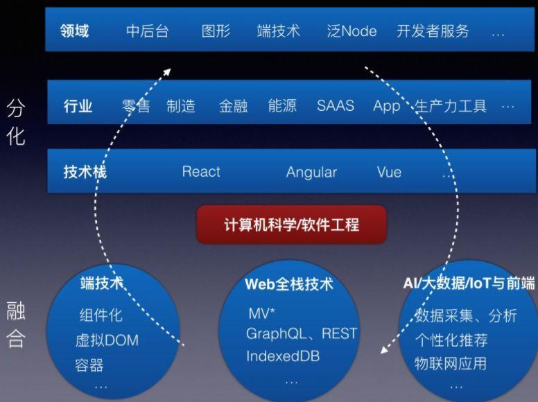

# 1.3.1 移动Web前端开发有前景吗

#### 1.领域

前端领域会继续分化，例如阿里内部的前端就已经有中后台、图形、端技术、泛Node、开发者服务5个大方向了，每个大方向也会细分，举一些例子：

1、中后台：有云控制台、信息&资产管理平台、内部研发&项目管理平台、人工智能&机器学习平台、数据研发分析平台等。具体产品如阿里云控制台、ERP、DeepInsight、Basecamp等。

2、图形：有基础图形库、3D图形、数据可视化、流程图等。具体产品如G2、阿里云城市大脑、滴滴智能交通调度图、双十一大屏等。

3、端技术：有移动端（iOS、Android、MobileWeb、PWA、小程序）、PC端（客户端、Web端）、触屏电脑、各种监控大屏、智能手表手环，智能汽车&家居屏幕等。

4、泛Node：有工具链、Web框架、IoT、客户端（Electron、NW）等。具体产品如DEF/F2E-Test（阿里前端开发者工具）、Egg.js、VS Code等。

5、开发者服务：有应用开发运维平台、组件市场等。具体产品如阿里云的应用搭建平台Fusion-Design组件市场，支付宝、微信小程序开发者工具等。

#### 2.一些个人小建议

关心人工智能的发展，思考TA在前端领域可能产生的应用场景

- 视觉稿自动生成代码

- 根据用户使用习惯自动排出最符合该用户习惯的界面

- 收集用户数据在前端实时做学习和分析，如deeplearn.js
