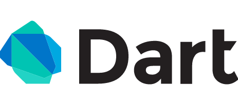
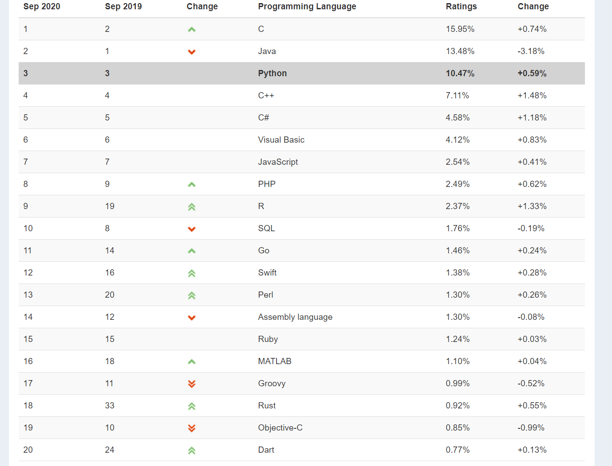

# 2.1.1 Dart介绍

## 1.Dart Language（Dart语言）

Dart是由Google于2011年开发的计算机编程语言，它可以被用于Web、服务器、移动应用和物联网等领域的开发。

Dart官网（需科学上网）：https://dart.dev/

国内Dart官网：https://dart.cn/

Dart 1.0最初设计是为了取代JavaScript成为Web开发的首选语言。

Dart 2.0的发布，专注于改善构建客户端应用程序的体验，可以看出定位的。

Google的野心：Dart冲前（前端），Go断后（后端）。

## 2.TIOBE Index for September 2020（2020年9月TIOBE开发语言排行榜）

官网：https://www.tiobe.com/tiobe-index/

**September Headline: Programming Language C++ is doing very well**

**9月份标题：C++编程语言做的很好**

TIOBE开发语言排行榜每月更新一次，依据的指数是基于世界范围内的资深软件工程师和第三方供应商提供，其结果作为当前业内程序开发语言的流行使用程度的有效指标。

该指数可以用来检阅开发者的编程技能能否跟上趋势，或是否有必要作出战略改变，以及什么编程语言是应该及时掌握的。观察认为，该指数反应的虽并非当前最流行或应用最广的语言，但对世界范围内开发语言的走势仍具有重要参考意义。
