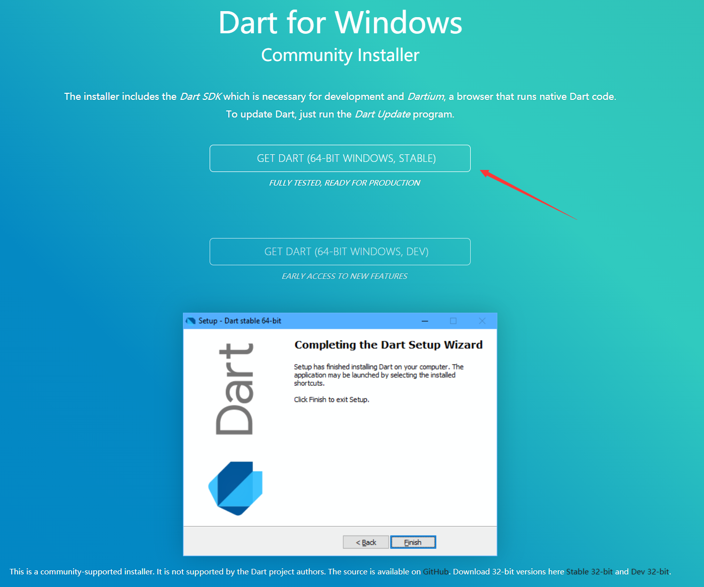

# 2.1.2 环境搭建

获取Dart SDK地址：https://dart.cn/get-dart

## 1.Windows环境的搭建

方法一：

Dart SDK下载（建议）：http://www.gekorm.com/dart-windows

方法二：

可以使用[Chocolatey](https://chocolatey.org/)，Chocolatey是在Windows下的包管理器。

安装Dart SDK（命令行）：

`choco install dart-sdk`

单词说明：install v.安装

更新Dart SDK (命令行)：

`choco upgrade dart-sdk`

单词说明：upgrade v.升级；提升

## 2.Linux环境的搭建

使用apt-get方式安装

命令行：

1.`sudo apt-get update`

单词说明：update v.更新

2.`sudo apt-get install apt-transport-https`

单词说明：transport v.运送

3.`sudo sh -c 'wget -qO- https://dl.google.com/linux/linux_signing_key.pub | apt-key add -'`

4.`sudo sh -c 'wget -qO- https://storage.flutter-io.cn/download.dartlang.org/linux/debian/dart_stable.list > /etc/apt/sources.list.d/dart_stable.list'`

Linux基本命令说明：

sudo 以系统管理者的身份执行指令，也就是说，经由 sudo 所执行的指令就好像是 root 亲自执行。

sh 是 shell 命令语言解释器，执行命令从标准输入读取或从一个文件中读取。

wget 可以跟踪 HTML 页面上的链接依次下载来创建远程服务器的本地版本，完全重建原始站点的目录结构。这又常被称作“递归下载”。

## 3.Mac环境的搭建

1.检查终端是否安装[brew](https://brew.sh/)，没有安装进行安装。

2.安装Dart

`brew tap dart-lang/dart`

单词说明：tap v.轻敲

brew tap 可以为 brew 的软件的跟踪，更新，安装添加更多的tap formulae

单词说明：formulae n.规则

tap 命令的仓库源默认来自于Github，但是这个命令也不限制于这一个地方。

`brew install dart`

3.更新Dart

`brew upgrade dart`
