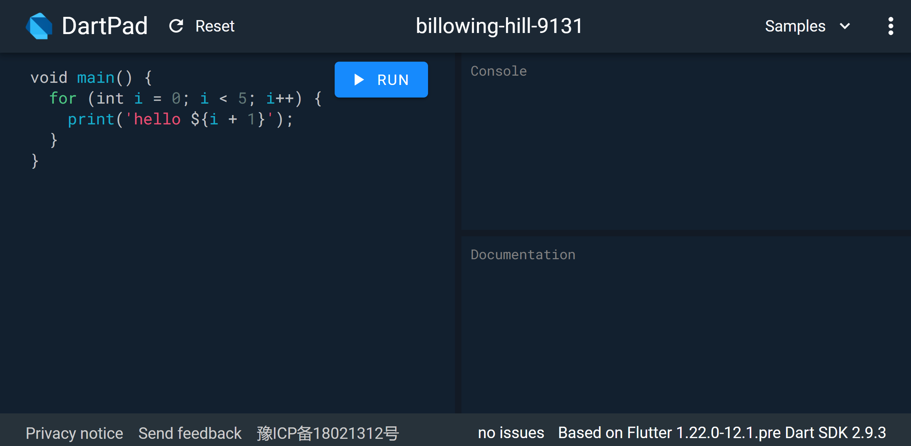
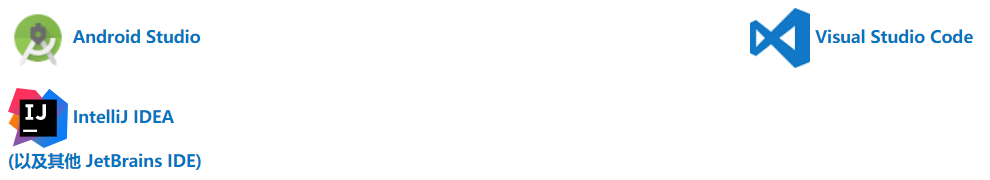
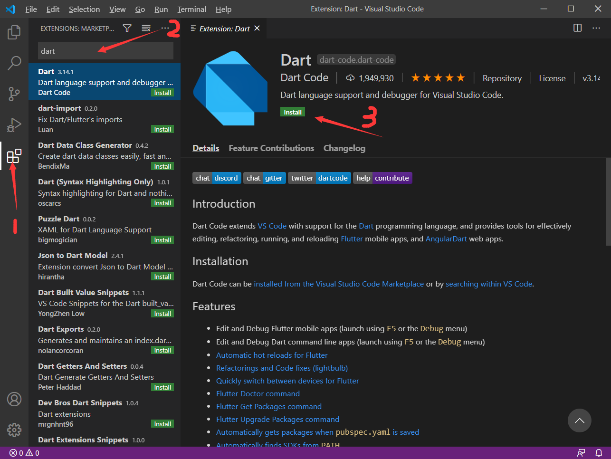
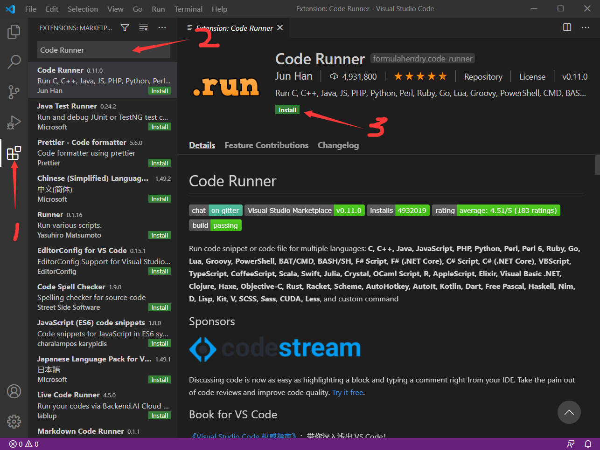
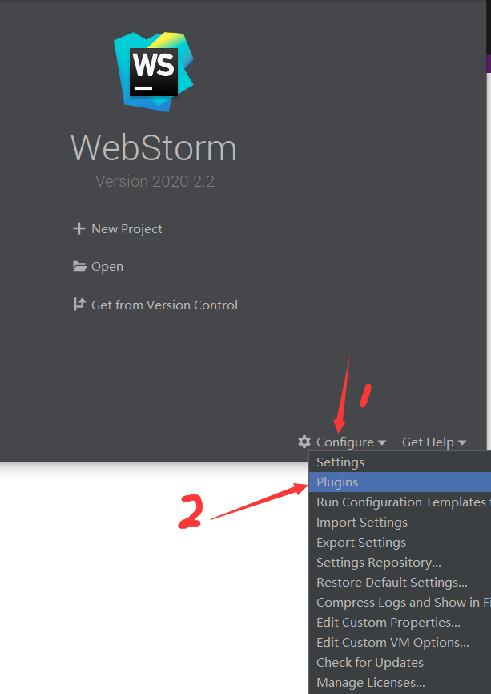
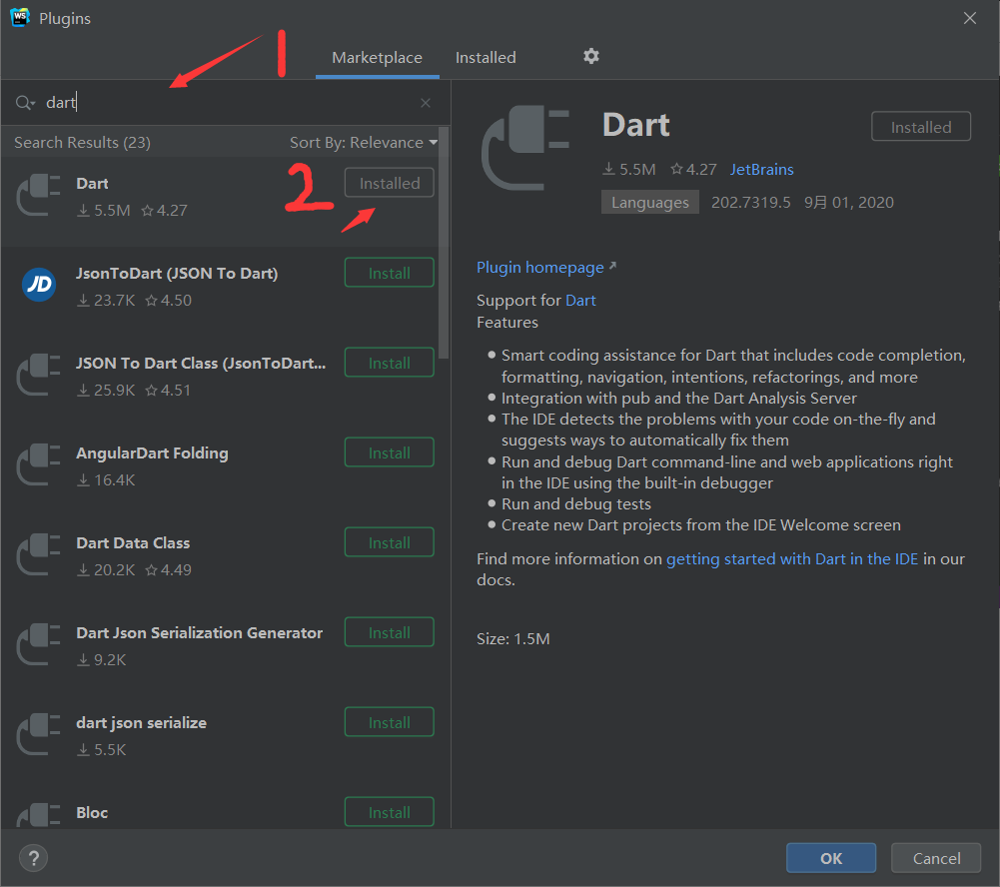
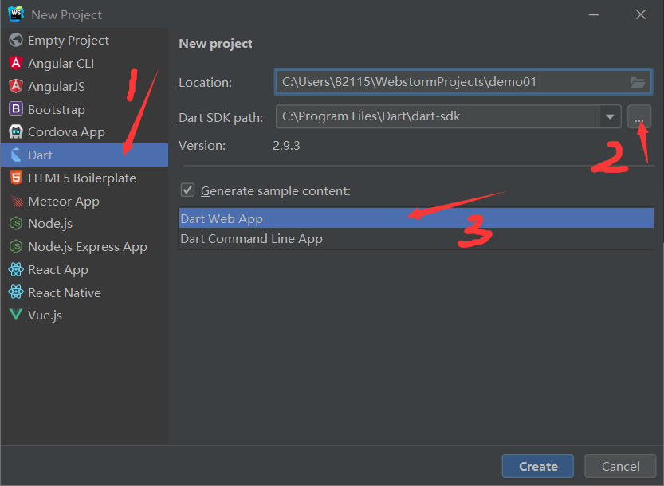

# 2.1.3 开发工具配置

## 1.DartPad

DartPad https://dartpad.cn/

无需下载，是学习 Dart 语法和体验 Dart 语言功能的一个非常棒的途径。它支持 Dart 的核心库，但不包括 VM 库。

## 2.IDE（Integrated Development Environment，集成开发环境）

### 1) VSCode

- 1.找到 VSCode 插件安装 Dart

- 2.找到 VSCode 插件安装 Code Runner ，Code Runner 可以运行编写的文件

### 2) WebStorm（JetBrains系列其中一个IDE为例）

- 1.打开 WebStorm IDE

- 2.安装 Dart

- 3.新建 Dart 项目

