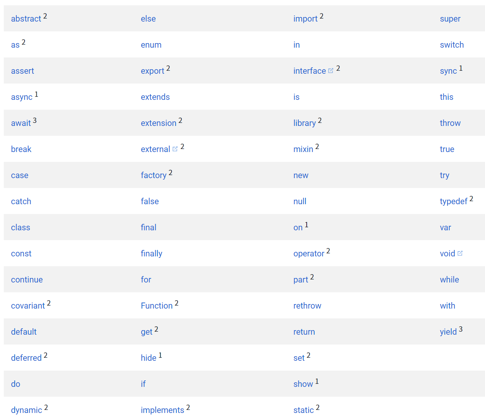

# 2.2.4 Dart的关键字和命名规则

## 1.Dart 的关键字



应该避免使用这些单词作为标识符。但是，带有上标的单词可以在必要的情况下作为标识符：

- 带有上标 1 的关键字为 上下文关键字，只有在特定的场景才有意义，它们可以在任何地方作为有效的标识符。

- 带有上标 2 的关键字为 内置标识符，其作用只是在JavaScript代码转为Dart代码时更简单，这些关键字在大多数时候都可以作为有效的标识符，但是它们不能用作类名或者类型名或者作为导入前缀使用。

- 带有上标 3 的关键字为 Dart1.0 发布后用于[支持异步](https://dart.cn/guides/language/language-tour#asynchrony-support)相关的特性新加的。不能在由关键字 async、async* 或 sync* 标识的方法体中使用 await 或 yield 作为标识符。

其它没有上标的关键字为 保留字，均不能用作标识符。


## 2.Dart 的命名规则

Dart的命名规则：

- 1、变量名称必须由数字、字母、下划线和美元符($)组成。

- 2.注意：标识符开头不能是数字

- 3.标识符不能是保留字和关键字。   

- 4.变量的名字是区分大小写的如: age和Age是不同的变量。在实际的运用中,也建议,不要用一个单词大小写区分两个变量。

- 5、标识符(变量名称)一定要见名思意 ：变量名称建议用名词，方法名称建议用动词。


```javascript
void main(){

    var str1='2134214';

    var 2str='xxx';   //错误

    var if='124214';  //错误


    变量的名字是区分大小写的
    var age=20;

    var Age=30;

    print(age);
    print(Age);


    var price=12;

    var name=124;

}
```
